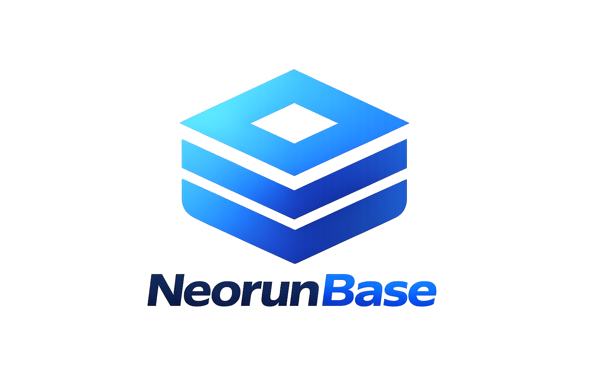

---
hide:
- navigation
- toc
- path
title: " "
---

  

<h2 align="center" style="margin-top: 1.5rem;">Distributed PostgreSQL-Compatible OLTP Lakebase</h2>

  NeorunBase is a sharded, replicated, end-to-end-encrypted database that speaks the PostgreSQL wire protocol — combining transactional OLTP, vector search, Apache Iceberg lakehouse sync, and Kafka streaming ingestion in a single engine.

  <a href="./installation/installation" style="background: #2563eb; color: white; padding: 14px 40px; border-radius: 8px; text-decoration: none; font-weight: 600; font-size: 1.2rem;">Download &amp; Install</a>

